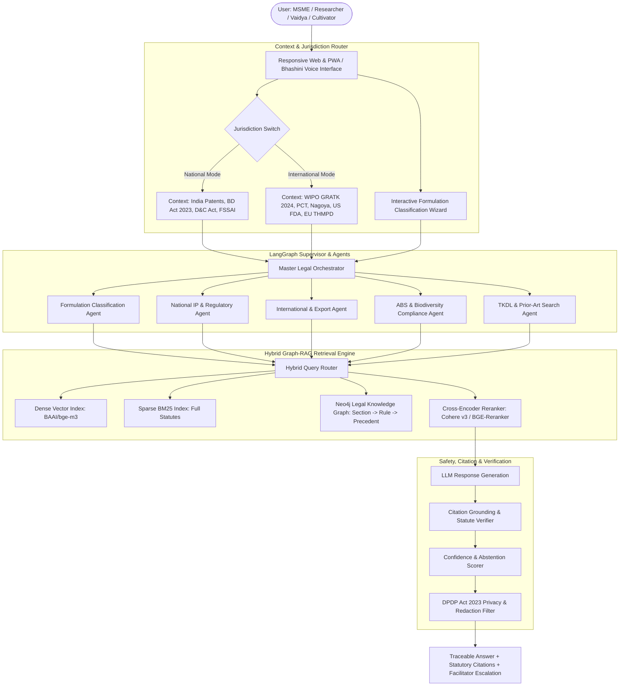

# IP-SAKTI Sahayak — Technical Architecture & Implementation Blueprint
**Problem Statement ID:** 26045  
**Problem Statement Title:** IP-SAKTI Sahayak: a multilingual, RAG-based (source-cited) AI assistant for Intellectual Property and regulatory guidance in Ayurveda, across national and international regimes.  
**Sponsoring Organization:** Ministry of Ayush / All India Institute of Ayurveda (AIIA)  
**Category:** Software | **Theme:** Smart Automation / Legal AI  

---

## 1. Executive Summary & Problem Decomposition
Ayurveda rests on a dual foundation of codified traditional knowledge (TK) and modern biological therapeutics. Protecting and commercializing Ayurvedic products requires navigating overlapping regimes:
- **IPR Regimes:** Patents, Trademarks, Geographical Indications (GI), Designs, Copyright, Trade Secrets, and Plant Variety Rights (PPVFRA).
- **Access & Benefit Sharing (ABS):** Biological Diversity Act, 2002 (amended 2023, Rules 2024), involving SBB/NBA approvals.
- **Drug & Food Regulations:** Drugs & Cosmetics Act 1940 (Rule 158B licensing), FSSAI Ayurveda-Aahar Regulations 2022, Drugs & Magic Remedies Act 1954.
- **International Market Access:** WIPO GRATK Treaty (2024), Nagoya Protocol, US FDA Botanical Drug Guidance, EU THMPD (2004/24/EC).

### Key Challenges Solved:
1. **Formulation Misclassification:** Innovators seeking patents for classical recipes are barred under Section 3(p); the assistant identifies classification first.
2. **Conflation of Jurisdictions:** An explicit toggle keeps Indian statutory mechanisms completely separate from international export requirements.
3. **Traceability & Non-Hallucination:** Every legal proposition is grounded in exact sections, rules, and gazette notifications with safe abstention on ambiguity.
4. **Vernacular Accessibility:** Grassroots *Vaidyas* and herb growers can query the system in regional Indian languages via Bhashini voice and text.

---

## 2. Ayurvedic Domain Complexity Matrix

| Product Category | Regulatory Basis (D&C / FSSAI) | Patentability Posture (Indian Patents Act) | ABS Obligation (Biological Diversity Act 2023/24) | Primary License & Clinical Path |
| :--- | :--- | :--- | :--- | :--- |
| **Classical Medicine (*Shastriya*)** | First Schedule texts (e.g. *Charaka*, *Sushruta*). | **Barred under § 3(p)** (Traditional Knowledge) & **§ 3(e)** (Admixture). Defended by TKDL. | Exempt for registered Ayush practitioners; SBB intimation for commercial manufacturing. | Form 25D / 26D. No clinical trials if classical recipe is followed. |
| **Patent & Proprietary (P&P)** | Ingredients in Schedule 1 texts, but formulation or dosage form modified (§ 3(h)). | High bar under **§ 3(d)** & **§ 3(e)**. Requires proven synergistic clinical effect. | Intimation/approval to State Biodiversity Board (SBB) / NBA. | D&C Rule 158B: Safety/efficacy literature or pilot clinical trial. |
| **New Ayurvedic Drug** | Novel extraction methods, non-classical bioactive combinations. | **Patentable** if novelty, inventive step, and industrial applicability are proven. | Mandatory **Form I/III approval from NBA** before applying for IPR abroad. | Comprehensive Phase I–III clinical trials under CT Rules. |
| **Phytopharmaceutical Drug** | Purified, standardized fraction with >= 4 bioactive markers. | **Patentable** (Composition of matter, extraction process, synergistic ratios). | Full NBA compliance, Prior Informed Consent (PIC), and MAT. | CDSCO approval under Schedule Y / Chapter V-A of D&C Rules. |
| **Ayurveda-Aahar (Nutraceutical)** | Food prepared per Ayurvedic texts for dietary health/wellness. | Non-patentable for recipes; protected via Trademarks and Trade Secrets. | SBB notification depending on bio-resource commercial sourcing. | FSSAI Ayurveda-Aahar Regulations 2022 (Schedules I–IV). |
| **Ayurvedic Cosmetic** | External application products (*Lepa*, *Taila*) without therapeutic claims. | Packaging designs (*Designs Act*), branding (*Trademarks*). | Exempt if sourced from conventional agricultural supply chains. | D&C Act Part XIII (Cosmetic licensing), BIS compliance. |

---

## 3. End-to-End System Architecture

---

## 4. Formulation Classification Decision Logic
The assistant initiates a structured clarifying dialogue before rendering advice:
1. **Source Text Check:** Is the exact formulation found in any First Schedule Ayurvedic text (*Charaka Samhita*, *Sushruta Samhita*, *Bhavaprakasha*, etc.)?
   - *If Yes:* Classified as **Classical Medicine**. Patent barred under § 3(p); defended by TKDL.
   - *If No:* Proceed to Step 2.
2. **Extract & Bioactive Processing:** Is the product using classical whole extracts (aqueous/oil) or standardized solvent fractions with quantified marker compounds?
   - *If Standardized >= 4 markers:* Potential **Phytopharmaceutical Drug**.
   - *If Synergistic combination:* Potential **Patent & Proprietary (P&P)** or **New Drug**.
3. **Therapeutic vs Dietary Intent:** Does the product claim cure/prevention of diseases, or dietary nutritional support?
   - *If Nutritional:* Classified under **FSSAI Ayurveda-Aahar Regulations 2022**.

---

## 5. Dual-Jurisdiction Switch Architecture
The system prevents legal hallucinations by strictly partitioning national and international legal reasoning:

### National Engine
- **Patents Act 1970 (amended 2024):** Sections 3(p), 3(e), 3(d), Rule 12 foreign filing statements.
- **Biological Diversity Act 2002 (amended 2023, Rules 2024):** NBA Form I (Access), Form II (Transfer), Form III (IPR Application), Form IV (Third-Party Commercialization). Exemptions for Ayush practitioners and cultivated medicinal plants.
- **Drug & Advertising Laws:** D&C Act 1940 (Rule 158B), Drugs and Magic Remedies Act 1954.

### International Engine
- **WIPO GRATK Treaty (Adopted May 2024):** Mandatory disclosure of origin for patent applications based on genetic resources and associated traditional knowledge.
- **PCT & Paris Convention:** 12-month priority window, 30/31-month national phase entry.
- **Target Export Markets:**
  - **USA:** US FDA *Botanical Drug Guidance* vs DSHEA Dietary Supplement route.
  - **EU:** Directive 2004/24/EC (*THMPD*) requiring proof of 30 years of safe traditional use.
  - **GCC:** MOHAP Herbal registration guidelines.

---

## 6. Vernacular & Voice Engine (Bhashini Integration)
- **Speech Pipeline:** Bhashini ASR (Automated Speech Recognition) $\rightarrow$ Indic-Trans2 NMT $\rightarrow$ Domain Entity Mapping $\rightarrow$ RAG $\rightarrow$ Indic-TTS.
- **Ayurvedic Concept Normalizer:** Sanskrit / Hindi botanical and processing terminology mapped to canonical taxonomy:
  - *Ashwagandha* $\leftrightarrow$ *Withania somnifera*
  - *Taila* $\leftrightarrow$ Medicated Oil Formulation (D&C Schedule T)
  - *Shodhana* $\leftrightarrow$ Standardized Purification Process

---

## 7. Technology Stack
- **Frontend:** React 19, Tailwind CSS, Lucide-Icons, KaTeX, Web Audio API / Bhashini Voice.
- **Backend:** FastAPI (Python 3.11), LangGraph multi-agent supervisor.
- **Knowledge Graph:** Neo4j (Cypher queries for statutory hierarchy).
- **Vector DB & Search:** Qdrant / Milvus (BAAI/bge-m3 dense + BM25 sparse hybrid).
- **LLM & Guardrails:** Anthropic Claude 3.5 Sonnet / Llama-3.1-70B (Air-gapped) + NeMo Guardrails.
