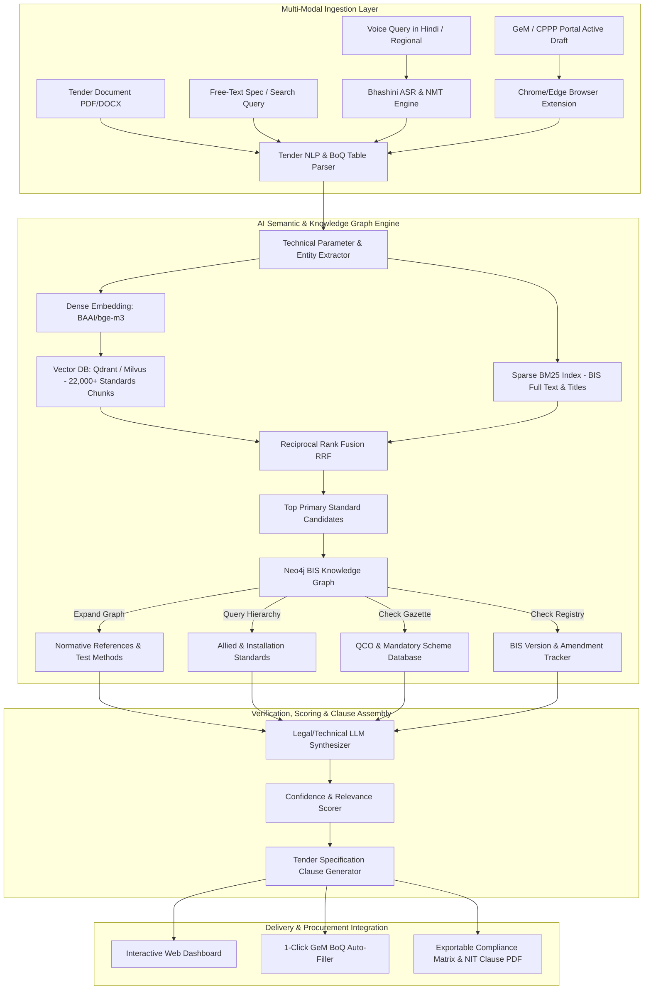

# AI-Powered Recommendation Engine for Indian Standards in Procurement
**Problem Statement ID:** 26108  
**Problem Statement Title:** AI-Powered Recommendation Engine for Identifying Applicable Indian Standards for Procurement Specifications  
**Sponsoring Organization:** Ministry of Consumer Affairs, Food & Public Distribution — Department of Consumer Affairs (DoCA) / Bureau of Indian Standards (BIS)  
**Category:** Software | **Theme:** Smart Automation / Public Procurement  

---

## 1. Executive Summary & Problem Context
In India's public procurement ecosystem (>₹4 Lakh Crore annually across GeM, CPPP, Railways IREPS, Defence, and State Portals), procurement officials routinely author technical specifications without standardisation expertise.

With over **22,000+ Indian Standards (IS)** published by BIS across 15 Division Councils:
1. **Outdated Standards Citing:** Tenders cite withdrawn, superseded, or obsolete standards (e.g. *IS 456:1978* instead of *IS 456:2000 Reaffirmed 2021*).
2. **Missing Normative References:** Tenders specify a primary product standard without citing required testing standards (e.g., specifying a cable without *IS 10810* flame retardant test or *IS 8130* conductor purity).
3. **Omission of Mandatory QCOs:** Quality Control Orders (QCOs) issued under Section 16 of the BIS Act 2016 make standard compliance legally binding; omitting them creates legal and procurement disputes.
4. **Vocabulary Mismatch:** Commercial trade descriptions (*"5 HP submersible agricultural pump"*) fail basic keyword lookups for formal BIS titles (*"Submersible Pumpsets — Specification (IS 14220)"*).

---

## 2. Indian Standards & Public Procurement Matrix

```
                                  ┌──────────────────────────┐
                                  │   Tender Product Spec    │
                                  └─────────────┬────────────┘
                                                │
                                                ▼
                                  ┌──────────────────────────┐
                                  │ Primary Product Standard │ (e.g., IS 694 - PVC Cables)
                                  └─────────────┬────────────┘
         ┌──────────────────────────────────────┼──────────────────────────────────────┐
         ▼                                      ▼                                      ▼
┌──────────────────────────┐          ┌──────────────────────────┐          ┌──────────────────────────┐
│   Normative References   │          │   Regulatory Posture     │          │    Lifecycle Tracker     │
├──────────────────────────┤          ├──────────────────────────┤          ├──────────────────────────┤
│ • Raw Mat: IS 8130 (Cu)  │          │ • QCO: Mandatory ISI     │          │ • Current: IS 694:2010   │
│ • Insul: IS 5831 (PVC)   │          │ • Scheme: BIS Scheme-I   │          │ • Status: Reaffirmed 2020│
│ • Test: IS 10810 (Fire)  │          │ • Ministry: DPIIT / MoP  │          │ • Latest: Amend. No. 1–3 │
│ • Install: IS 732 (Code) │          │ • Violation: Non-bailable│          │ • Superseded: IS 694:1990│
└──────────────────────────┘          └──────────────────────────┘          └──────────────────────────┘
```

### Key Division Councils & Regulatory Schemes
- **ETD (Electrotechnical):** Transformers (*IS 1180*), Cables (*IS 694*, *IS 7098*), Motors, Switchgear $\rightarrow$ **Scheme-I (ISI Mark) + Mandatory BEE Star Rating**.
- **LITD (Electronics & IT):** Laptops, Displays, LED Luminaires (*IS 10322*), IT Safety (*IS 13252*) $\rightarrow$ **Scheme-II (CRS - Compulsory Registration Scheme)** via MeitY.
- **CED (Civil Engineering):** TMT Rebars (*IS 1786*), Cement (*IS 1489*, *IS 269*), Concrete (*IS 456*), Pipes (*IS 458*) $\rightarrow$ **Scheme-I (ISI Mark)** + Ministry of Steel QCOs.
- **MED (Mechanical Engineering):** Submersible Pumps (*IS 14220*), Valves (*IS 778*), Cranes, Compressors $\rightarrow$ **Scheme-I (ISI Mark)**.
- **TXD (Textiles):** Geotextiles (*IS 16391*), Medical PPE, Uniforms $\rightarrow$ **Ministry of Textiles QCOs**.

---

## 3. End-to-End System Architecture



---

## 4. Core Technical Modules & Algorithms

### Module 1: Hybrid Semantic & Cross-Domain Matcher
Combines dense semantic vector similarity with sparse BM25 keyword matching over BIS Standard Titles, Scopes, and Clause 1 definitions:
$$\text{RRF Score}(d) = \sum_{m \in \{\text{Dense}, \text{Sparse}\}} \frac{1}{k + \text{Rank}_m(d)} \quad (k = 60)$$

### Module 2: Neo4j Normative Reference & Allied Graph Expander
Standards are modeled as directed graphs:
- `(:IndianStandard)-[:HAS_NORMATIVE_REF]->(:IndianStandard)`
- `(:IndianStandard)-[:TEST_METHOD_DEFINED_IN]->(:IndianStandard)`
- `(:QualityControlOrder)-[:MANDATES_STANDARD]->(:IndianStandard)`
- `(:IndianStandard)-[:SUPERSEDES]->(:IndianStandard)`

### Module 3: Version Lifecycle & Obsolescence Guard
Validates active status, revision year, reaffirmed dates, and latest amendments directly against the BIS catalog.
- Alerts user if a standard is *WITHDRAWN*, *CANCELLED*, or *SUPERSEDED*.
- Automatically injects latest amendments (e.g. *IS 694:2010 with Amendments 1–3*).

### Module 4: Mandatory QCO & Certification Compliance Engine
Cross-checks product categories against Central Government notifications (DPIIT, Ministry of Steel, MeitY CRS, Ministry of Textiles) to enforce mandatory ISI mark / CRS requirements.

---

## 5. Sample Generated Tender Specification Clause

```markdown
### TECHNICAL SPECIFICATION CLAUSE (Generated for Tender Ref: TNDR/2026/ELECT/089)

#### 1. PRIMARY APPLICABLE STANDARD:
The item **"Single Core 1.5 sq.mm FRLSH Copper Cable"** shall strictly conform to:
* **IS 694 : 2010 (Fourth Revision, Reaffirmed 2020)** — *PVC Insulated Cables for Working Voltages up to and Including 1100 V*, incorporating Amendment Nos. 1, 2, and 3.

#### 2. NORMATIVE & ALLIED REFERENCE STANDARDS:
The raw materials, construction, and testing shall comply with:
* **IS 8130 : 2013 (Reaffirmed 2018):** Conductors for insulated electric cables and flexible cords (Class 2 / Class 5 Copper).
* **IS 5831 : 1984 (Reaffirmed 2019):** PVC insulation and sheath of electric cables (Type C & Type ST-2 compounds).
* **IS 10810 (Relevant Parts):** Methods of test for cables:
  - Part 41: Oxygen Index test (Min 29% per ASTM D 2863)
  - Part 61: Flame retardant test
  - Part 62: Fire resistance test in bunched cables

#### 3. MANDATORY REGULATORY & CERTIFICATION COMPLIANCE:
* **Quality Control Order (QCO) Status:** MANDATORY COMPLIANCE under *DPIIT Electrical Wires and Cables (Quality Control) Order*.
* **Certification Scheme:** The manufacturer must hold a valid **BIS Product Certification License (ISI Mark - Scheme I)**.
* **Tender Requirement:** Bidder shall upload a valid BIS License copy with endorsements for the offered cable sizes. Unmarked / self-declared items shall be rejected.
```

---

## 6. Included Data Files in this Repository
All datasets generated from official BIS sources are available in `/Users/rishii/SIH-2026/data/`:
1. `bis_mandatory_qco_scheme1.json` (752 ISI Mark mandatory products & QCOs)
2. `bis_mandatory_crs_scheme2.json` (30 MeitY CRS mandatory electronics/IT products)
3. `indian_standards_master_catalog.json` (Structured master taxonomy across 15 Division Councils)
4. `bis_normative_graph_triples.json` (53 Knowledge Graph triples for Neo4j)
5. `sample_procurement_tenders_eval.json` (4 Real-world benchmark evaluation tenders)
