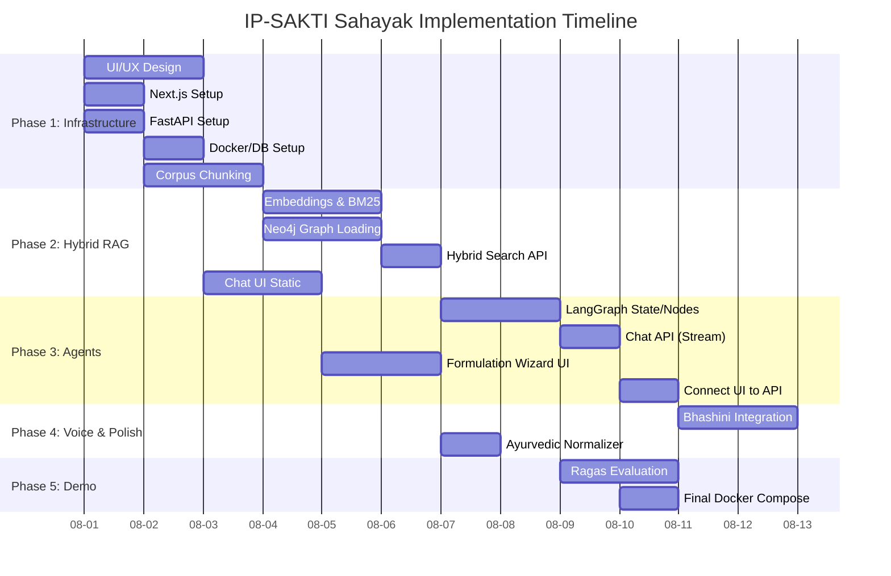

# Implementation Plan: IP-SAKTI Sahayak (SIH 2026 PS-26045)

**Problem Statement:** IP-SAKTI Sahayak: a multilingual, RAG-based (source-cited) AI assistant for Intellectual Property and regulatory guidance in Ayurveda.
**Sponsoring Org:** Ministry of Ayush / AIIA
**Target Date:** 2026

## 1. Project Directory Structure

The project will use a monorepo structure to keep everything tightly integrated and easy to deploy via Docker Compose.

```text
ip-sakti-sahayak/
├── client/                     # Next.js 15 Frontend (React 19)
│   ├── app/
│   │   ├── (chat)/             # Chat interface routes
│   │   ├── (wizard)/           # Formulation classification wizard
│   │   ├── api/                # Next.js serverless route handlers (BFF)
│   │   ├── layout.tsx          # Root layout (Bhashini context provider)
│   │   └── page.tsx            # Landing page
│   ├── components/
│   │   ├── chat/               # MessageBubble, CitationInspector, AudioRecorder
│   │   ├── ui/                 # shadcn/ui components (Tailwind)
│   │   └── wizard/             # JurisdictionSwitch, ABSForm
│   ├── lib/
│   │   ├── api.ts              # FastAPI client wrapper
│   │   ├── bhashini.ts         # Bhashini SDK/wrapper
│   │   └── store.ts            # Zustand global state (if needed)
│   ├── public/                 # Static assets (PWA manifest, icons)
│   ├── next.config.mjs         # Next.js config
│   ├── package.json
│   └── tsconfig.json
│
├── server/                     # FastAPI Backend
│   ├── app/
│   │   ├── api/
│   │   │   ├── routes/         # Router endpoints (chat, classify, sync)
│   │   │   └── dependencies.py # FastAPI Depends (DB, Vector Store, Auth)
│   │   ├── core/               # Config (Pydantic BaseSettings), Security
│   │   ├── db/                 # Postgres/Neo4j connection logic
│   │   ├── models/             # Pydantic schema models
│   │   ├── services/           # Business logic (bge-m3 inference, BM25)
│   │   └── agents/             # LangGraph agent definitions
│   │       ├── supervisor.py   # Main router agent
│   │       ├── ip_agent.py     # IP & Patents agent
│   │       ├── bd_agent.py     # Biodiversity / ABS agent
│   │       └── tkdl_agent.py   # TK prior-art mock agent
│   ├── Dockerfile
│   ├── pyproject.toml          # Poetry dependencies
│   └── main.py                 # FastAPI application entry point
│
├── ml/                         # ML Pipeline Scripts (Data Processing & RAG setup)
│   ├── scripts/
│   │   ├── 01_parse_docs.py    # Unstructured.io parsing scripts
│   │   ├── 02_chunking.py      # Semantic chunking logic
│   │   ├── 03_embed.py         # Generate bge-m3 embeddings
│   │   ├── 04_bm25_index.py    # Build sparse BM25 indices
│   │   └── 05_graph_build.py   # LLM-assisted relation extraction for Neo4j
│   └── requirements.txt
│
├── graph/                      # Neo4j setup
│   ├── schema.cypher           # Node/Edge definitions & constraints
│   ├── init_data.cypher        # Seed data (Acts, Sections, Concepts)
│   └── queries.cypher          # Standard retrieval queries
│
├── data/                       # Raw corpus (Ignored in Git, mounted in dev)
│   ├── raw/                    # PDFs (Patents Act, BD Act, D&C Act)
│   ├── processed/              # Clean JSON/Parquet chunks
│   └── indices/                # Saved BM25 sparse indices
│
├── eval/                       # Ragas Evaluation Suite
│   ├── ground_truth.json       # 25 Q&A pairs with reference context
│   ├── run_ragas.py            # Evaluation script
│   └── metrics_report.md       # Output of evaluation runs
│
├── docker/                     # Deployment Definitions
│   ├── docker-compose.yml      # Full dev stack (FastAPI, Next, Postgres, Neo4j, Qdrant)
│   ├── docker-compose.prod.yml # Production stack (air-gapped compatible)
│   └── init-postgres.sql       # Postgres init scripts
│
└── docs/                       # Project Documentation
    ├── architecture.md
    └── api_contracts.md
```

## 2. Phase-by-Phase Implementation Plan (14 Days)

### Phase 1: Knowledge Corpus & Infrastructure (Days 1-3)

**Goal:** Base infrastructure running, data corpus collected, and chunked.

**Rishii (Frontend Lead)**
*   **Task 1.1:** Scaffold Next.js 15 app router workspace, configure Tailwind & shadcn. (4 hrs)
    *   *Path:* `client/package.json`, `client/tailwind.config.ts`
*   **Task 1.2:** Design responsive app layout, navigation sidebar. (4 hrs)
    *   *Path:* `client/app/layout.tsx`
*   **Dependencies:** None.
*   **DoD:** Empty Next.js app running at localhost:3000 with basic layout.

**Prerak (Backend Lead)**
*   **Task 1.3:** Setup FastAPI project using Poetry. Setup `main.py`, config loader. (4 hrs)
    *   *Path:* `server/pyproject.toml`, `server/app/core/config.py`
*   **Task 1.4:** Setup basic routing and healthcheck. Setup CORS. (2 hrs)
    *   *Path:* `server/app/main.py`
*   **Dependencies:** None.
*   **DoD:** FastAPI swagger running at localhost:8000/docs.

**Diksha (Database & Vector Architect)**
*   **Task 1.5:** Write Docker Compose for Postgres (pgvector) + Neo4j + Qdrant. (4 hrs)
    *   *Path:* `docker/docker-compose.yml`
*   **Task 1.6:** Define relational DDL schemas (if needed for chat history). (3 hrs)
    *   *Path:* `docker/init-postgres.sql`
*   **Dependencies:** None.
*   **DoD:** `docker compose up -d` successfully spins up 3 database services.

**Sahaj (ML/RAG Owner)**
*   **Task 1.7:** Corpus Collection. Gather PDFs: Patents Act 1970, BD Act 2002/2023, D&C Act, FSSAI Ayurveda-Aahar. (3 hrs)
    *   *Path:* `data/raw/`
*   **Task 1.8:** Write semantic chunking pipeline using `unstructured` & LangChain text splitters. (5 hrs)
    *   *Path:* `ml/scripts/02_chunking.py`
*   **Dependencies:** Corpus collected.
*   **DoD:** `processed_chunks.json` created with meaningful 512-token chunks and metadata.

**Tanishka (UI/UX Lead)**
*   **Task 1.9:** Create Figma wireframes for Desktop & Mobile views. (6 hrs)
*   **Task 1.10:** Define typography and color palette. (2 hrs)
*   **Dependencies:** None.
*   **DoD:** Figma prototype linked and reviewed by Rishii.

**Member 6 (QA & Benchmarking)**
*   **Task 1.11:** Draft 25 Ground Truth Test Cases based on typical Ayurveda IP queries. (6 hrs)
    *   *Path:* `eval/ground_truth.json`
*   **Dependencies:** None.
*   **DoD:** JSON file with `query`, `expected_answer`, and `source_document`.

### Phase 2: Hybrid Graph-RAG & Retrieval (Days 4-6)

**Goal:** Vector, Sparse, and Graph databases populated and queryable via FastAPI.

**Sahaj (ML/RAG Owner)**
*   **Task 2.1:** Generate bge-m3 embeddings for chunks and load to Qdrant/pgvector. (4 hrs)
    *   *Path:* `ml/scripts/03_embed.py`
*   **Task 2.2:** Build BM25 index on chunked data. (3 hrs)
    *   *Path:* `ml/scripts/04_bm25_index.py`
*   **Task 2.3:** Implement Reciprocal Rank Fusion (RRF) and Cross-Encoder re-ranking. (5 hrs)
    *   *Path:* `server/app/services/retrieval.py`
*   **Dependencies:** Diksha's Vector DB setup, Chunking completed.
*   **DoD:** Python script can run a query and return top 5 reranked chunks.

**Diksha (Database Architect)**
*   **Task 2.4:** Design Neo4j Schema: `(Act)-[:HAS_SECTION]->(Section)-[:APPLIES_TO]->(Concept)`. (4 hrs)
    *   *Path:* `graph/schema.cypher`
*   **Task 2.5:** Write Cypher statements to load basic entity graph. (5 hrs)
    *   *Path:* `graph/init_data.cypher`
*   **Dependencies:** Chunking & entity extraction script (ML).
*   **DoD:** Neo4j browser visualizes the basic legal relationships.

**Prerak (Backend Lead)**
*   **Task 2.6:** Expose `/api/v1/search` endpoint wrapping Sahaj's retrieval service. (4 hrs)
    *   *Path:* `server/app/api/routes/search.py`
*   **Dependencies:** Sahaj's RRF implementation.
*   **DoD:** REST API successfully returns hybrid search results.

**Rishii (Frontend Lead) & Tanishka**
*   **Task 2.7:** Build Chat Interface (MessageBubble, Input area). (6 hrs)
    *   *Path:* `client/components/chat/`
*   **Task 2.8:** Build Source Citation Inspector component. (4 hrs)
    *   *Path:* `client/components/chat/CitationInspector.tsx`
*   **Dependencies:** Figma designs.
*   **DoD:** Static chat UI visually matches Figma, with hardcoded state.

### Phase 3: Multi-Agent System & Classification (Days 7-9)

**Goal:** LangGraph workflow integrated with the frontend Wizard.

**Sahaj (ML/RAG) & Prerak (Backend)**
*   **Task 3.1:** Define LangGraph State and Agent Nodes (Supervisor, IP, BD). (6 hrs)
    *   *Path:* `server/app/agents/supervisor.py`
*   **Task 3.2:** Implement decision logic for Routing. (4 hrs)
*   **Task 3.3:** Expose `/api/v1/chat` streaming endpoint (SSE or WebSockets). (4 hrs)
    *   *Path:* `server/app/api/routes/chat.py`
*   **Dependencies:** Retrieval endpoint.
*   **DoD:** API can receive a query, route to the correct sub-agent, and stream response.

**Rishii (Frontend) & Tanishka**
*   **Task 3.4:** Build Formulation Wizard UI (Form logic for selecting herbs/methods). (5 hrs)
    *   *Path:* `client/app/(wizard)/page.tsx`
*   **Task 3.5:** Implement Dual-Jurisdiction Switch (India vs International). (3 hrs)
*   **Task 3.6:** Connect Chat UI to Backend `/api/v1/chat` streaming endpoint. (4 hrs)
*   **Dependencies:** Backend chat API.
*   **DoD:** Wizard collects formulation data; Chat UI streams real responses.

### Phase 4: Voice, Citations & Frontend Polish (Days 10-12)

**Goal:** Multilingual support and UX polishing.

**Rishii & Tanishka**
*   **Task 4.1:** Integrate Web Audio API for recording voice. (4 hrs)
    *   *Path:* `client/components/chat/AudioRecorder.tsx`
*   **Task 4.2:** Integrate Bhashini API (ASR on audio, TTS on text). (6 hrs)
    *   *Path:* `client/lib/bhashini.ts`
*   **Task 4.3:** Responsive design polish, PWA configuration (Service Workers). (5 hrs)
*   **Dependencies:** Bhashini API Keys.
*   **DoD:** User can speak Hindi, see Hindi text translated to English, get answer in English, translated back to Hindi, and spoken aloud.

**Prerak (Backend)**
*   **Task 4.4:** Ayurvedic Concept Normalizer (e.g., matching "Ashwagandha" to Withania somnifera) before search. (4 hrs)
    *   *Path:* `server/app/services/normalizer.py`
*   **Dependencies:** None.

**Member 6 (QA)**
*   **Task 4.5:** Test all 25 ground truth queries against live system. (5 hrs)
*   **DoD:** Documented pass/fail rate for queries.

### Phase 5: Evaluation, Docker & Demo (Days 13-14)

**Goal:** Finalize Docker deployment, run benchmarks, prep for presentation.

**Member 6 (QA) & Sahaj (ML)**
*   **Task 5.1:** Run Ragas evaluation (Faithfulness, Answer Relevance, Context Precision/Recall). (4 hrs)
    *   *Path:* `eval/run_ragas.py`
*   **DoD:** Generated `metrics_report.md`.

**Diksha & Prerak**
*   **Task 5.2:** Finalize Docker Compose for complete air-gapped demo (local LLM models via Ollama if requested, or proper env injection). (5 hrs)
    *   *Path:* `docker/docker-compose.prod.yml`
*   **DoD:** One command `docker compose -f docker-compose.prod.yml up` starts everything.

**Entire Team**
*   **Task 5.3:** Presentation slide deck.
*   **Task 5.4:** Pitch rehearsal and video recording fallback.

---

## 3. Dependency Graph (Mermaid Gantt)



---

## 4. Integration Points & Contracts

### 4.1 API Contracts (Frontend ↔ Backend)

**POST `/api/v1/chat`**
*Request:*
```json
{
  "messages": [{"role": "user", "content": "Does my Triphala churna need NBA approval?"}],
  "jurisdiction": "india",
  "metadata": {
    "herbs": ["Amalaki", "Bibhitaki", "Haritaki"]
  }
}
```

*Response (Streaming Server-Sent Events):*
```json
{"chunk": "Based on the Biological Diversity Act...", "type": "text"}
{"chunk": {"source": "BD Act 2002, Sec 3", "confidence": 0.95}, "type": "citation"}
```

### 4.2 Pydantic Models (`server/app/models/schemas.py`)
```python
from pydantic import BaseModel, Field
from typing import List, Optional

class Citation(BaseModel):
    document_id: str
    text_snippet: str
    relevance_score: float

class ChatRequest(BaseModel):
    query: str
    history: List[dict] = Field(default_factory=list)
    jurisdiction: str = "india"

class ChatResponse(BaseModel):
    answer: str
    citations: List[Citation]
    routed_agent: str
```

### 4.3 Database DDL (Neo4j Schema Example)
```cypher
// Create constraints
CREATE CONSTRAINT act_id ON (a:Act) ASSERT a.id IS UNIQUE;
CREATE CONSTRAINT section_id ON (s:Section) ASSERT s.id IS UNIQUE;

// Relationship structure
// (Act {name: 'Patents Act'})-[:CONTAINS]->(Section {num: '3(p)'})-[:MENTIONS]->(Concept {name: 'Traditional Knowledge'})
```

---

## 5. Risk Register

| Risk | Probability | Impact | Mitigation Strategy | Owner |
| :--- | :--- | :--- | :--- | :--- |
| **Bhashini API Rate Limits** | High | Medium | Implement caching of TTS. Implement robust retry mechanisms. Fallback to browser-native speech API. | Rishii |
| **LangGraph Latency** | Medium | High | Use smaller models (Llama3-8B) for routing/supervisor logic. Cache frequent answers. | Sahaj / Prerak |
| **Neo4j Cypher Complexity** | Medium | Medium | Pre-compute common sub-graphs. Keep the ontology strictly limited to Acts -> Sections -> Concepts. | Diksha |
| **Poor RAG Retrieval on Legal Text**| High | High | Use Hybrid (Vector + BM25). Implement Cross-Encoder (e.g. `cross-encoder/ms-marco-MiniLM-L-6-v2`) reranking. | Sahaj |

---

## 6. Technology Decisions Log

| Component | Choice | Why? | Alternatives Considered |
| :--- | :--- | :--- | :--- |
| **Frontend** | **Next.js 15 (App Router)** | Excellent API route handling (BFF pattern), fast RSC rendering, easy Vercel deployment. | React SPA (Vite) - Lacks easy backend-for-frontend routing. |
| **Backend API** | **FastAPI** | High concurrency (async/await) crucial for LLM streaming & API calls. Pydantic validation. | Django (Too heavy), Express/Node (Harder to integrate with PyData/ML stack). |
| **LLM Framework**| **LangGraph** | Provides cyclic, stateful multi-agent workflows. Better than raw LangChain for complex decision trees (Supervisor -> Agents). | AutoGen (Steeper learning curve, harder to constrain), CrewAI. |
| **Vector DB** | **Qdrant (or pgvector)** | Fast, easy to run locally in Docker. Excellent metadata filtering required for legal clauses. | Pinecone (Not air-gapped/local), Milvus (Too resource intensive). |
| **Graph DB** | **Neo4j** | Industry standard for Knowledge Graphs. Excellent visualization and Cypher support. | Amazon Neptune (Cloud-only), ArangoDB. |
| **Embeddings** | **BAAI/bge-m3** | Strong multilingual support, supports dense + sparse representations natively. | OpenAI `text-embedding-3-small` (Cloud dependent). |

---

## 7. Environment Setup Guide

**Prerequisites:**
*   Docker & Docker Compose
*   Python 3.11+
*   Node.js 20+ (with `pnpm`)

**1. Clone & Env Setup:**
```bash
git clone https://github.com/organization/ip-sakti-sahayak.git
cd ip-sakti-sahayak
cp .env.example .env
```

**2. `.env` Template (Key Variables):**
```env
# Backend
OPENAI_API_KEY=sk-...
BHASHINI_API_KEY=...
QDRANT_HOST=localhost
QDRANT_PORT=6333
NEO4J_URI=bolt://localhost:7687
NEO4J_USER=neo4j
NEO4J_PASSWORD=password
```

**3. One-Command Setup:**
```bash
# Start DBs
docker compose up -d

# Setup Backend
cd server
poetry install
poetry run uvicorn app.main:app --reload

# Setup Frontend (New terminal)
cd client
pnpm install
pnpm dev
```

---

## 8. Testing Strategy

1.  **Unit Tests (Backend):** Use `pytest`. Focus on pure Python logic (Chunking functions, query parsers, Pydantic model validation).
    *   Command: `pytest server/tests/`
2.  **Integration Tests (API):** Use FastAPI `TestClient` to test the `/api/v1/search` endpoints with a mocked vector database.
3.  **RAG Evaluation (Ragas):**
    *   Dataset: `eval/ground_truth.json` (25 cases).
    *   Metrics: *Answer Relevance* (>0.85 target), *Faithfulness* (>0.9 target to prevent hallucinations on legal advice), *Context Precision*.
4.  **E2E Tests (Frontend):** Use Playwright. Test the critical path: User opens app -> Types query -> Receives streaming response -> Clicks citation.

---

## 9. Deployment Strategy

**A. Cloud Deployment (Primary Demo)**
*   **Frontend:** Vercel (Auto-deploys from `main` branch).
*   **Backend & DBs:** Render or AWS EC2 (Dockerized).
*   **Managed Services:** Supabase (for pgvector/postgres) or AuraDB (Neo4j managed).

**B. Local Air-Gapped Mode (Jury Backup)**
*   Use `docker-compose.prod.yml`.
*   Includes Ollama container running `llama3:8b-instruct`.
*   Local Qdrant and Neo4j.
*   Requires ~16GB RAM laptop.

**C. Video Fallback:**
*   Record a pristine 3-minute screen recording of the core flows (Text Query, Voice Query, Wizard) to play if Wi-Fi completely fails at the venue.

---

## 10. Sprint Milestones & Checkpoints

| Day | Milestone | Verification Criteria |
| :--- | :--- | :--- |
| **Day 3** | Repo Scaffold & Data Chunked | Next.js and FastAPI run locally. Chunks available in JSON. |
| **Day 6** | Basic RAG & Chat UI | API returns semantic search results. Frontend displays static chat UI. |
| **Day 9** | LangGraph Agents Connected | Query routing works. Frontend receives streaming SSE responses. |
| **Day 12** | Voice & Polish | Bhashini TTS/ASR working on frontend. UI is responsive and styled. |
| **Day 14** | Code Freeze & Eval Run | Ragas report generated. Docker compose up works cleanly on a fresh machine. |
