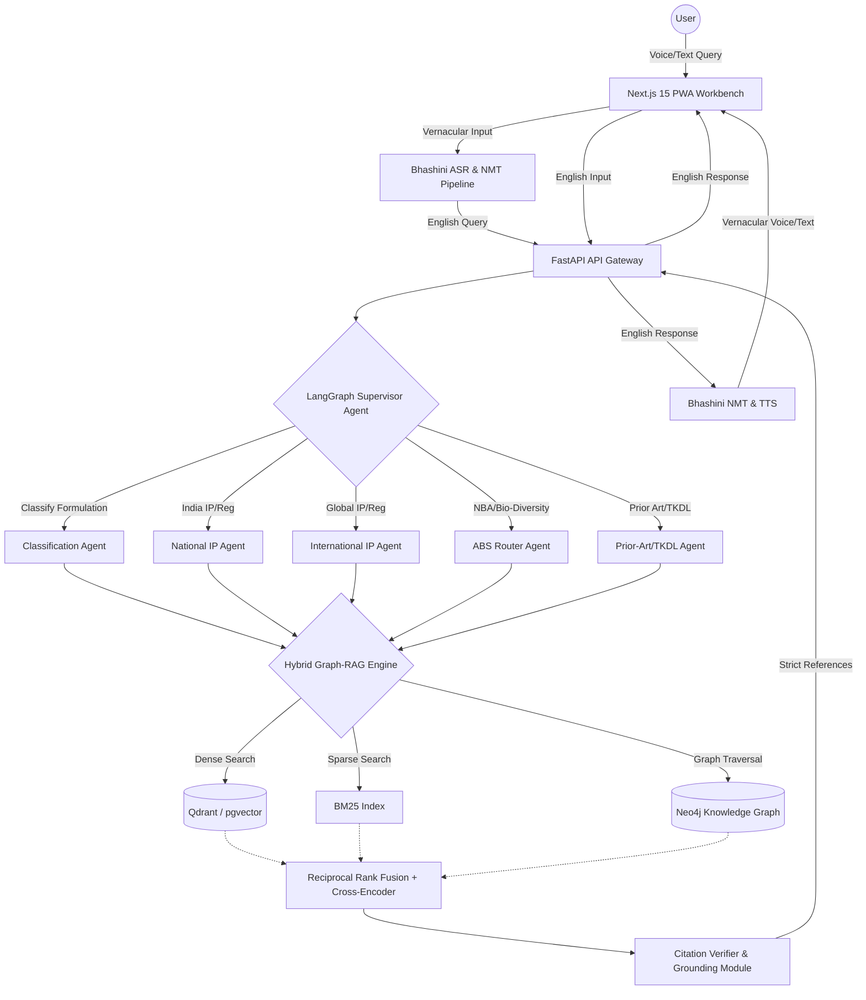

# SIH 2026 PS-26045 Walkthrough: IP-SAKTI Sahayak

**Problem Statement:** IP-SAKTI Sahayak: a multilingual, RAG-based (source-cited) AI assistant for Intellectual Property and regulatory guidance in Ayurveda, across national and international regimes.
**Sponsoring Org:** Ministry of Ayush / All India Institute of Ayurveda (AIIA)
**Category:** Software | **Theme:** Smart Automation / Legal AI

---

## TEAM ROLES

*   **Rishii:** Frontend Lead (Next.js 15 / React 19). ML Mentor — only steps in when Sahaj is stuck.
*   **Sahaj:** Primary ML/RAG owner — embeddings, BM25, Neo4j Cypher, LangGraph agents.
*   **Tanishka:** UI/UX Lead (Figma), domain research, frontend styling.
*   **Prerak:** Backend Lead (FastAPI), Docker, async pipelines.
*   **Diksha:** Database & Vector Architect (PostgreSQL/Supabase, pgvector/Qdrant).
*   **Member 6:** QA & Benchmarking (Ragas suite, ground-truth test cases, offline demo prep).

---

## 1. Problem Deep Dive

### The Core Problem and Its Importance
The intellectual property landscape for Ayurveda and traditional medicine is notoriously complex. Innovators, from grassroots MSMEs to established pharmaceutical companies, struggle to navigate the labyrinth of the Patents Act, 1970 (specifically Sections 3(p), 3(e), 3(d)), the Biological Diversity (BD) Act, 2002/2023, the Drugs and Cosmetics (D&C) Act, and FSSAI regulations. 

Internationally, the landscape is even more fragmented. The WIPO GRATK (Genetic Resources and Associated Traditional Knowledge) 2024 treaty, the US FDA Botanical Drug Guidance, and the EU Traditional Herbal Medicinal Products Directive (THMPD) all have distinct, often conflicting requirements for prior art, efficacy demonstration, and Access and Benefit Sharing (ABS).

This complexity leads to:
1.  **High rejection rates:** Patent applications are routinely rejected under Section 3(p) (traditional knowledge) due to poor drafting and lack of understanding of TKDL (Traditional Knowledge Digital Library) defenses.
2.  **Regulatory non-compliance:** Startups face heavy penalties for failing to secure National Biodiversity Authority (NBA) approval before applying for IP, or for misclassifying a product under the D&C Act.
3.  **Exploitation of traditional knowledge:** Without accessible tools, biopiracy remains a risk, and true innovations often lack proper legal protection.

### Target Personas
*   **MSME Founders & Ayush Startups:** Need clear, actionable steps on whether their formulation is patentable or simply requires a manufacturing license.
*   **Ayush Researchers:** Require rapid prior-art searches and clarity on international patentability for novel extraction methods.
*   **Rural Vaidyas & Herb Growers:** Need multilingual access to understand ABS rights and how to legally commercialize traditional recipes.
*   **Patent Attorneys & Legal Professionals:** Use the tool for deep, cited legal research, relying on exact Section and Rule citations to draft responses to First Examination Reports (FERs).

### Current Pain Points
*   **Scattered Information:** Acts, Rules, Guidelines, and Gazette Notifications are spread across multiple poorly indexed government websites in unsearchable PDF formats.
*   **Lack of Multilingual Support:** Legal texts are primarily in English, isolating grassroots practitioners.
*   **Hallucination in Generic LLMs:** Standard LLMs (like ChatGPT) confidently provide incorrect legal advice (hallucinations), which is catastrophic in legal compliance.
*   **Misclassification:** For example, a user might develop a novel extraction of Ashwagandha and attempt to patent it as a "New Drug" without realizing it falls under "Phytopharmaceutical," requiring entirely different clinical trial data under Schedule Y.

---

## 2. Solution Architecture Walkthrough

IP-SAKTI Sahayak is designed as an agentic, hybrid-RAG architecture with strict citation grounding to eliminate hallucinations. 



### Flow of a Query
1.  **Input:** A user asks, "क्या मैं अश्वगंधा और गिलोय के नए काढ़े का पेटेंट करा सकता हूँ?" (Can I patent a new decoction of Ashwagandha and Giloy?).
2.  **Voice/Translation:** Bhashini ASR transcribes the audio, and NMT translates it to English. The Ayurvedic Concept Normalizer standardizes "Ashwagandha" to *Withania somnifera*.
3.  **Supervisor Routing:** The LangGraph Supervisor identifies the query as a patentability question involving traditional herbs and routes it to the **Classification Agent** and **National IP Agent**.
4.  **Hybrid Retrieval:** 
    *   *Dense Search* finds semantic matches for patenting traditional mixtures.
    *   *Sparse (BM25)* looks for exact keywords in the Patents Act.
    *   *Graph Traversal (Neo4j)* pulls the relationship: `(Section 3p) -[EXCLUDES]-> (Traditional Knowledge)`.
5.  **Reranking & Citation:** The retrieved context is reranked. The Citation Verifier ensures the LLM generates a response explicitly citing "Section 3(p) of the Patents Act, 1970."
6.  **Response:** The system advises that a mere admixture is not patentable under Section 3(e) and 3(p), but a novel synergistic extraction process might be. The English response is translated back to Hindi and spoken via TTS.

---

## 3. The 6 Core Modules — Detailed Explanation

### Module 1: Formulation Classification Wizard
*   **WHAT:** An interactive or conversational wizard that categorizes the user's formulation into exact legal buckets.
*   **WHY:** The regulatory pathway for a "Classical Ayurvedic Drug" (needs Form 25D) is entirely different from a "New Phytopharmaceutical" (needs clinical trials). Users don't know this.
*   **HOW:** It uses a deterministic decision tree encoded in LangGraph. It asks clarifying questions: "Is the recipe documented in the 54 authoritative books of the First Schedule of D&C Act?" If yes -> Classical. If it's a novel extraction -> Phytopharmaceutical.
*   **TECH:** LangGraph, FastAPI, Next.js interactive flow.

### Module 2: Dual-Jurisdiction Switch
*   **WHAT:** Strict partitioning of legal databases between National (India) and International regimes.
*   **WHY:** Prevents legal hallucinations where the LLM might apply a US FDA Botanical rule to an Indian D&C Act query.
*   **HOW:** The metadata of every document chunk is tagged with `jurisdiction: 'IN'` or `jurisdiction: 'INTL'`. The API enforces a hard pre-filter on the vector search based on the active toggle in the UI or the implicit intent of the user's query.
*   **TECH:** Qdrant payload filtering / PostgreSQL `WHERE` clauses alongside vector matching.

### Module 3: Hybrid Graph-RAG Retrieval Engine
*   **WHAT:** The core search engine combining vectors, keywords, and graph relationships.
*   **WHY:** Dense embeddings alone fail on exact section numbers (e.g., "Section 3(d)"). BM25 fails on semantic meaning. Graphs are needed for hierarchical legal structures (Act -> Chapter -> Section -> Clause).
*   **HOW:** 
    1.  Uses `bge-m3` (1024-d) for dense embeddings.
    2.  Uses Elasticsearch/BM25 for sparse keyword search.
    3.  Uses Neo4j to find linked precedents.
    4.  Combines results using Reciprocal Rank Fusion (RRF): `Score = 1 / (k + rank_dense) + 1 / (k + rank_sparse)`.
    5.  Passes top 10 chunks to a Cross-Encoder (e.g., `bge-reranker-v2-m3`) for final sorting.
*   **TECH:** Qdrant, Neo4j, `bge-m3`, Cross-Encoders.

### Module 4: LangGraph Multi-Agent Supervisor
*   **WHAT:** A multi-agent framework managing specialized AI workers.
*   **WHY:** A single prompt is too complex to handle classification, patent search, and biodiversity compliance simultaneously.
*   **HOW:** 
    *   **Supervisor:** An LLM with tools to route to sub-agents.
    *   **ABS Agent:** Specialized in the Biological Diversity Act. Checks if the biological resource requires NBA approval (Form 1).
    *   **National IP Agent:** Specialized in the Indian Patents Act and Trade Marks Act.
    *   The state is passed between agents, accumulating context before generating the final answer.
*   **TECH:** LangChain, LangGraph, GPT-4o / Claude 3.5 Sonnet.

### Module 5: Citation Grounding & Verification
*   **WHAT:** A post-processing module that enforces strict legal citations.
*   **WHY:** Lawyers and regulators need exact sources, not generic advice.
*   **HOW:** The generation prompt forces the LLM to output responses in JSON with a `"citations"` array mapping every claim to a specific source chunk ID. A verification script checks if the claim actually exists in the retrieved chunk. If confidence is low, it triggers a safe-abstention logic ("I cannot provide legal certainty on this, but based on Section X..."). Includes a DPDP Act filter to redact PII from any user-uploaded documents.
*   **TECH:** Pydantic output parsers, Guardrails AI / custom strict JSON schemas.

### Module 6: Bhashini Vernacular Voice Engine
*   **WHAT:** Multilingual speech-to-speech interaction.
*   **WHY:** Digital inclusion for non-English speaking Vaidyas and farmers.
*   **HOW:** 
    *   Integrates Bhashini APIs.
    *   Crucial step: **Ayurvedic Concept Normalizer**. Direct translation often destroys technical terms. "Tulsi" might translate weirdly depending on context. We maintain a dictionary mapping vernacular terms (Hindi, Tamil, Marathi, Sanskrit) to canonical botanical names (*Ocimum tenuiflorum*) before hitting the English RAG pipeline.
*   **TECH:** Bhashini REST APIs, Python text processing, local dictionary mapping.

---

## 4. Technology Stack Deep Dive

| Component | Technology | Why Chosen? |
| :--- | :--- | :--- |
| **Frontend** | Next.js 15 (React 19), Tailwind CSS, Framer Motion | RSCs for fast loading, server actions for secure API calls, excellent for building complex dashboard UIs (Workbench). |
| **State Management** | Zustand | Lightweight, avoids Redux boilerplate, great for managing complex multi-pane workbench state. |
| **Backend API** | FastAPI (Python) | Native async support, auto-generated OpenAPI docs, fast execution, perfect for ML/AI microservices. |
| **Multi-Agent Orchestration** | LangGraph | State-based agent control allows for cyclic graphs and explicit tool routing, superior to standard Langchain chains. |
| **Vector Database** | PostgreSQL + pgvector (or Qdrant) | pgvector allows relational metadata filtering alongside vector search. Qdrant is an alternative if scale requires dedicated HNSW. |
| **Knowledge Graph** | Neo4j | Native graph DB required to map complex hierarchical legal relationships (e.g., Act -> Section -> Sub-section -> Case Law). |
| **Embeddings Model** | `BAAI/bge-m3` | Multilingual, supports dense, sparse, and multi-vector representations, 1024 dimensions. |
| **Reranker** | `BAAI/bge-reranker-v2-m3` | Drastically improves retrieval accuracy by cross-scoring query and context chunks. |
| **LLM (Reasoning)** | GPT-4o / Claude 3.5 Sonnet | Highest reasoning capabilities required for legal interpretation. |
| **Translation/Speech** | Bhashini APIs | Government-backed, highly accurate for Indian regional languages and dialects. |
| **Evaluation** | Ragas | Standard framework for RAG evaluation (Context Precision, Recall, Faithfulness). |

---

## 5. Database Schema Design

### Relational Schema (PostgreSQL via Supabase)

**Table: `legal_documents`**
```sql
CREATE TABLE legal_documents (
    id UUID PRIMARY KEY DEFAULT uuid_generate_v4(),
    title VARCHAR(255) NOT NULL,
    act_name VARCHAR(255),
    jurisdiction VARCHAR(10) CHECK (jurisdiction IN ('IN', 'INTL')),
    document_type VARCHAR(50) CHECK (document_type IN ('Act', 'Rule', 'Gazette', 'CaseLaw', 'Guidelines')),
    publish_date DATE,
    source_url TEXT,
    created_at TIMESTAMP WITH TIME ZONE DEFAULT NOW()
);
```

**Table: `document_chunks` (pgvector)**
```sql
CREATE TABLE document_chunks (
    id UUID PRIMARY KEY DEFAULT uuid_generate_v4(),
    document_id UUID REFERENCES legal_documents(id) ON DELETE CASCADE,
    section_number VARCHAR(50),
    content TEXT NOT NULL,
    chunk_index INTEGER,
    embedding vector(1024), -- bge-m3 dimension
    metadata JSONB -- stores keywords, entities
);
-- Create HNSW index for fast similarity search
CREATE INDEX ON document_chunks USING hnsw (embedding vector_cosine_ops);
```

### Knowledge Graph Schema (Neo4j Cypher)

```cypher
// Create Nodes
CREATE (act:Act {name: "Patents Act, 1970", jurisdiction: "IN"})
CREATE (sec:Section {number: "3(p)", description: "Inventions falling within traditional knowledge"})
CREATE (concept:Concept {name: "Traditional Knowledge"})
CREATE (case:CaseLaw {title: "Turmeric Patent Case", year: 1997})

// Create Relationships
CREATE (act)-[:HAS_SECTION]->(sec)
CREATE (sec)-[:REGULATES]->(concept)
CREATE (case)-[:INTERPRETS]->(sec)
```

---

## 6. API Endpoint Specification

**Base URL:** `/api/v1`

| Method | Endpoint | Description | Request Body | Response |
| :--- | :--- | :--- | :--- | :--- |
| `POST` | `/chat/query` | Main RAG query endpoint. | `{"query": "string", "session_id": "uuid", "jurisdiction": "IN|INTL", "language": "en|hi"}` | `{"answer": "string", "citations": [{"chunk_id": "uuid", "text": "...", "source": "..."}]}` |
| `POST` | `/audio/transcribe` | Handles voice input via Bhashini. | `multipart/form-data` (audio file) | `{"text": "string", "detected_lang": "hi"}` |
| `POST` | `/audio/synthesize` | Generates TTS via Bhashini. | `{"text": "string", "language": "hi"}` | Audio Stream |
| `POST` | `/wizard/classify` | Step in the classification wizard. | `{"answers": {"is_traditional": true, ...}}` | `{"classification": "Classical", "next_steps": ["Form 25D"]}` |
| `GET` | `/documents/citation/{chunk_id}` | Fetches full context for a citation. | None | `{"document_title": "...", "section": "...", "full_text": "..."}` |

---

## 7. Frontend Component Architecture

**Framework:** Next.js 15 App Router

**Component Tree:**
```text
app/
├── (auth)/
│   └── login/page.tsx
├── (dashboard)/
│   ├── layout.tsx (Sidebar, Header, Auth Guard)
│   ├── page.tsx (Dashboard Home - Recent queries, analytics)
│   ├── wizard/
│   │   └── page.tsx (Formulation Classification interactive flow)
│   ├── workbench/
│   │   └── page.tsx (Main 3-pane research interface)
│   └── settings/
│       └── page.tsx
components/
├── ui/ (shadcn/ui base components)
├── chat/
│   ├── ChatInterface.tsx (Main chat window)
│   ├── MessageBubble.tsx (Renders markdown + citation badges)
│   └── VoiceInputWidget.tsx (Mic button, visualizer, handles Bhashini API)
├── workbench/
│   ├── CitationInspector.tsx (Right pane: highlights exact text in source doc)
│   ├── JurisdictionToggle.tsx (Switch between IN/INTL)
│   └── EntityGraphViewer.tsx (Optional: visualizes Neo4j graph context)
└── shared/
    └── PdfViewer.tsx
```

**3-Pane Workbench Layout:**
1.  **Left Pane:** Chat History & Saved Sessions.
2.  **Center Pane:** Active Chat Interface (Input area, Voice widget, LLM responses).
3.  **Right Pane:** Citation Inspector. When a user clicks a citation badge `[1]` in the chat, this pane opens the original PDF/Text, scrolled to and highlighting the exact legal paragraph referenced.

---

## 8. Data Pipeline & Ingestion Flow

1.  **Source Collection:** Scraping IndiaCode, WIPO, FDA, FSSAI websites for Acts, Rules, and Gazette notifications (PDF/HTML).
2.  **Parsing & Cleaning:** Using `unstructured.io` or `LlamaParse` to extract text while maintaining document structure (Headers, Tables).
3.  **Semantic Chunking:** Crucial step. We do NOT use generic fixed-size chunking. We use **Section-level chunking**. A chunk represents exactly one legal section or sub-section, ensuring context isn't split mid-sentence.
4.  **Metadata Extraction:** An LLM pass over each chunk to extract metadata: `{"act": "Patents Act", "section": "3(d)", "keywords": ["efficacy", "new form", "known substance"]}`.
5.  **Graph Extraction:** A secondary LLM pass extracts triples (Subject, Predicate, Object) to populate the Neo4j Knowledge Graph.
6.  **Embedding:** Generating 1024-d vectors using `bge-m3` and storing them in pgvector/Qdrant.

---

## 9. Evaluation Strategy

To ensure zero legal hallucinations, the system is evaluated rigorously using the **Ragas** framework.

**Metrics Tracked:**
*   **Faithfulness (Groundedness):** >= 0.95. Ensures every claim in the generated answer can be inferred from the retrieved context.
*   **Answer Relevance:** >= 0.90. Ensures the answer directly addresses the user's prompt.
*   **Context Recall:** >= 0.90. Evaluates if the retriever fetched all necessary information required to answer the query.

**Ground-Truth Test Cases (25+ curated by legal experts):**
*   *Query:* "Can I patent a turmeric wound healing cream?"
    *   *Expected Response:* No, under Sec 3(p) as traditional knowledge. Cite TKDL precedents.
*   *Query:* "What approvals do I need to export an Ashwagandha extract from India?"
    *   *Expected Response:* Need NBA approval under Biological Diversity Act, Sec 3 & 4.

**A/B Testing:**
Comparing baseline Naive RAG (OpenAI embeddings + cosine similarity) vs. IP-SAKTI Hybrid Graph-RAG (RRF + Cross-Encoder + Neo4j) on the ground-truth dataset.

---

## 10. Demo Strategy & SIH Jury Playbook

### The 3-Tier Zero-Risk Demo Strategy
1.  **Tier 1 (Live Cloud):** The main live application hitting live APIs.
2.  **Tier 2 (Local Fallback):** The entire stack (Next.js, FastAPI, local PostgreSQL/pgvector, local LLM via Ollama/vLLM) running on a high-end laptop, entirely offline.
3.  **Tier 3 (Video Pre-record):** A high-quality 4K screen recording of the perfect run-through, available on the desktop.

### 5-Minute Live Demo Script
*   **Minute 0-1:** Introduction. State the problem (Legal complexity in Ayurveda IP) and show the solution (IP-SAKTI Sahayak).
*   **Minute 1-2:** **The Multilingual Voice Demo.** Click the mic, speak in Hindi: *"मैं एक किसान हूँ, क्या मैं अपने खेत के आंवले से बनी दवा बेच सकता हूँ?"* (I am a farmer, can I sell medicine made from Amla from my field?). Show real-time translation and the accurate, legally cited response in Hindi voice.
*   **Minute 2-3:** **The Deep Legal Research (Workbench).** Ask a complex English query about "Section 3(d) applicability on a novel nano-emulsion of Curcumin." Show the multi-agent routing in the console. 
*   **Minute 3-4:** **Citation Inspector.** Click on the citation badge in the response. Show the right pane instantly opening the exact paragraph in the Gazette notification. Emphasize *zero hallucination*.
*   **Minute 4-5:** **Formulation Wizard & Analytics.** Briefly show the interactive wizard for classifying a product, and the dashboard showing analytics. End with impact.

### Anticipated Jury Questions
*   **Q:** *How do you prevent the AI from giving wrong legal advice?*
    *   **A:** "We use strict Citation Grounding. The LLM is mathematically forced (via JSON schema) to link every sentence to a retrieved chunk. If the retrieval score is below a threshold, the system abstains rather than hallucinates."
*   **Q:** *Legal texts are huge. How do you handle chunking?*
    *   **A:** "We don't use arbitrary character limits. We use semantic, section-aware parsing so a 'chunk' represents a complete legal thought, keeping the metadata intact."
*   **Q:** *What if the internet goes down in a rural area?*
    *   **A:** "The frontend is a PWA that caches recent queries. We are also optimizing a smaller SLM (Small Language Model) version that can run locally on edge devices for basic queries."
